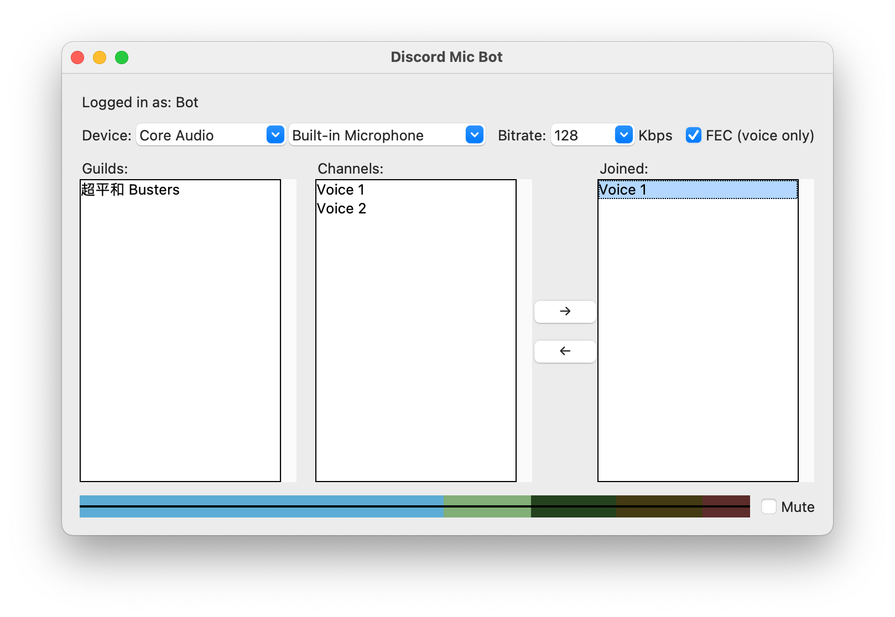

# discord-mic-bot

Discord bot to connect to your microphone―and you can have stereo sound



## Description

Discord transmits only mono sound to voice channel, which makes it a bad
experience if you want to sing karaoke or play an instrument in a voice party.
However, bot can transmit stereo sound to voice channel. Thus, you can connect
to your party channel as a bot. (You will need an admin to approve.)

Hey Discord developers, listen to these feedbacks! Shame on you!
- [2018-12-28: Stereo audio](https://support.discord.com/hc/en-us/community/posts/360036186992-Stereo-audio)
- [2019-07-28: Allow users to have stereo mic output as an option](https://support.discord.com/hc/en-us/community/posts/360048093091-Allow-users-to-have-stereo-mic-output-as-an-option-)
- [2019-08-25: XLR stereo support](https://support.discord.com/hc/en-us/community/posts/360050181312-XLR-stereo-support)
- [2019-09-09: Update your audio codec to allow for stereo mic setups](https://support.discord.com/hc/en-us/community/posts/360050373871-Update-your-audio-codec-to-allow-for-stereo-mic-setups)
- [2020-01-14: Make stereo in Discord calls](https://support.discord.com/hc/en-us/community/posts/360056292532-Make-stereo-in-Discord-calls)
- [2020-06-08: Stereo voice (for music DJ, music lesson, etc.)](https://support.discord.com/hc/en-us/community/posts/360068101212-Stereo-voice-for-music-DJ-music-lesson-etc-)
- [2020-10-25: Stereo mic support](https://support.discord.com/hc/en-us/community/posts/360052098693-Stereo-mic-support)

## Installation

First, install [uv](https://docs.astral.sh/uv/) and download discord-mic-bot.

Install the native audio libraries:

- macOS with Homebrew:
  ```sh
  brew install opus portaudio
  ```
- Linux: install libopus and libportaudio with your distribution's package manager.

Then set up the uv-managed Python environment:

```sh
cd /path/to/discord-mic-bot
uv python install 3.12
uv sync --managed-python --python 3.12
```

## Obtaining a bot token

You need to obtain a bot token to log into Discord's server.

1. Go to <https://discord.com/developers/applications> and click on "New
   Application".

2. Inside the settings panel of your new application, click on "Bot".

3. Create a new bot. When asked about permissions, simply leaving blank is
   enough.

4. Click on "Copy Token".

5. Copy `.env.example` to `.env` and paste your token there:

   ```sh
   cp .env.example .env
   ```

   Edit `.env` so it contains:

   ```dotenv
   DISCORD_BOT_TOKEN=your-token-here
   ```

   `.env` is ignored by Git; never commit real bot tokens.

## Inviting the bot to a Discord server

Note: You need to have the permission to invite a bot to the destination server.
If you don't have such a permission, the destination server **will not be
shown** in step 4. You can also ask an administrator who has such a permission
to help you invite your bot.

1. Go to <https://discord.com/developers/applications> and click on your already
   created application.

2. Click on "Copy Client ID".

3. Go to
   ```
   https://discord.com/oauth2/authorize?client_id=<CLIENT_ID>&permissions=3145728&scope=bot
   ```
   (Replace `<CLIENT_ID>` with your Client ID)

4. Choose your destination server. Then click "Authorize".


## Usage

For Linux or macOS users, run:

```sh
./discord-mic-bot
```

For Windows users, run:

```cmd
discord-mic-bot.cmd
```

Both wrapper scripts run the app through uv's managed Python and load `.env` automatically.

## Monitoring loudness

The loudness meter is compatible to EBU R 128 / ITU-R BS.1770, showing the
perceptible loudness for the last 0.4 seconds.

```
-70 ================================= -32 ============= -14 ==== -5 === 0 LUFS
 |                Blue                 |      Green      | Yellow | Red |
-70 ================================= -32 ============= -14 ==== -5 === 0 LUFS
```
* The left end is calibrated to -70 LUFS.
* Between blue and green is -32 LUFS.
* Between green and yellow is -14 LUFS.
* Between yellow and red is -5 LUFS.
* The right end is calibrated to 0 LUFS.

For music streaming, it is recommended to aim for -14 LUFS.

But if you are playing the background music while people are speaking, try to
lower down an extra 20 dB. **(i.e., aim for -34 LUFS.)**

This widget is designed to only give you a rough intuition of your loudness. If
you want to seriously measure your outgoing signal, try
[Youlean Loudness Meter (shareware)](https://youlean.co/youlean-loudness-meter/)
for Windows and macOS or
[ebumeter](https://wiki.linuxaudio.org/apps/all/ebumeter) for Linux.

My [live-loudness-normalizer](https://github.com/m13253/sb-jsfx-plugins) plugin
can also help you manage your stream loudness in realtime.

## License

This program is free software: you can redistribute it and/or modify it under
the terms of the GNU General Public License as published by the Free Software
Foundation, either version 3 of the License, or (at your option) any later
version.

You should have received a copy of the [GNU General Public License](LICENSE)
along with this program.

## Acknowledgment

This program is inspired by (but not a fork from)
[discord-audio-pipe](https://github.com/QiCuiHub/discord-audio-pipe).
Thank you QiCuiHub!
